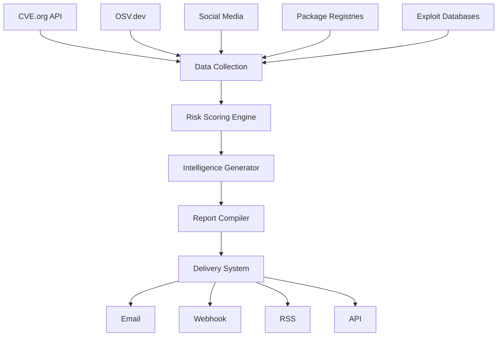

# Daily CVE Intelligence Report System Design

## Overview

The Daily CVE Intelligence Report system provides security analysts with a prioritized, actionable summary of vulnerabilities that matter. Unlike traditional CVE feeds that overwhelm with noise, this system delivers opinionated insights based on real-world impact and exploitability.

## Report Generation Architecture



## Core Components

### 1. Opinionated Ranking Algorithm

```python
class OpinionatedRanker:
    def calculate_priority_score(self, vuln):
        """
        Opinionated scoring that reflects real-world risk
        """
        base_score = 0
        
        # CVSS is overrated, but still matters
        base_score += self._normalize_cvss(vuln.cvss) * 15
        
        # EPSS is the best predictor we have
        base_score += vuln.epss_score * 30
        
        # Popularity is crucial - who cares about vulns in unused software?
        popularity = self._get_popularity_score(vuln)
        base_score += popularity * 25
        
        # Social buzz indicates real-world concern
        social_score = self._get_social_signals(vuln)
        base_score += social_score * 10
        
        # Exploit availability is a game changer
        if vuln.has_public_exploit:
            base_score += 20
        elif vuln.has_poc:
            base_score += 10
            
        # Boost for specific concerning patterns
        if self._is_supply_chain_attack(vuln):
            base_score *= 1.5
        if self._is_zero_click(vuln):
            base_score *= 1.3
        if self._affects_critical_infrastructure(vuln):
            base_score *= 1.2
            
        # Penalties for mitigating factors
        if vuln.requires_user_interaction:
            base_score *= 0.8
        if vuln.requires_privileges:
            base_score *= 0.9
        if self._has_simple_mitigation(vuln):
            base_score *= 0.7
            
        return min(base_score, 100)  # Cap at 100
```

### 2. Intelligence Context Generator

```python
class IntelligenceContextGenerator:
    def generate_why_this_matters(self, vuln):
        """
        Generate human-readable context explaining the real impact
        """
        context = {
            'headline': self._generate_headline(vuln),
            'key_points': [],
            'affected_scale': self._calculate_affected_scale(vuln),
            'business_impact': self._assess_business_impact(vuln),
            'similar_incidents': self._find_similar_incidents(vuln),
            'expert_opinion': self._get_expert_consensus(vuln)
        }
        
        # Build key points based on vulnerability characteristics
        if vuln.is_wormable:
            context['key_points'].append(
                "⚠️ Self-propagating: Can spread without user interaction"
            )
        
        if vuln.affects_popular_framework:
            downloads = self._get_download_stats(vuln.affected_component)
            context['key_points'].append(
                f"📊 Massive reach: {downloads:,} weekly downloads"
            )
        
        if vuln.has_been_exploited_before:
            context['key_points'].append(
                "🎯 History repeats: Similar vulns exploited in the wild"
            )
        
        return context

    def _generate_headline(self, vuln):
        """Generate attention-grabbing but accurate headline"""
        templates = {
            'rce_popular': "{component} RCE affects {percent}% of {ecosystem} apps",
            'supply_chain': "Supply chain attack on {component} impacts {count} projects",
            'zero_day': "Actively exploited {component} zero-day discovered",
            'authentication_bypass': "{component} auth bypass threatens {use_case}"
        }
        
        pattern = self._identify_pattern(vuln)
        return templates[pattern].format(**vuln.context_data)
```

### 3. Report Template System

```python
# reports/templates/daily_intelligence.md.j2

# 🔒 Daily Vulnerability Intelligence Report
**Date**: {{ report_date }}  
**Analyst**: AI-Assisted Intelligence System  
**Classification**: TLP:WHITE

---

## 🚨 IMMEDIATE ACTION REQUIRED

### {{ loop.index }}. {{ vuln.cve_id }} - {{ vuln.headline }}

**Priority Score**: {{ vuln.priority_score }}/100  
**Affected Component**: {{ vuln.component }} {{ vuln.version_range }}

**Why This Matters**:
{{ vuln.why_this_matters }}

**Immediate Actions**:
1. {{ vuln.action_1 }}
2. {{ vuln.action_2 }}
3. {{ vuln.action_3 }}

**Technical Details**:
- CVSS: {{ vuln.cvss }} | EPSS: {{ vuln.epss }}%
- Exploit Available: {{ '✅ Yes' if vuln.exploit_available else '❌ No' }}
- Patch Available: {{ '✅ Yes' if vuln.patch_available else '🔄 In Progress' }}

---


## 📊 Executive Summary

**Key Metrics**:
- New Critical Vulnerabilities: {{ metrics.critical_count }}
- Exploits Published Today: {{ metrics.new_exploits }}
- Average Time to Exploit: {{ metrics.avg_tte }} days
- Most Targeted Sector: {{ metrics.top_sector }}

**Trend Analysis**:
{{ trend_analysis }}

## 🎯 Prioritized Vulnerability List

### High Priority (Immediate Action)

{{ loop.index }}. **{{ vuln.cve_id }}** - {{ vuln.component }}
   - Risk Score: {{ vuln.risk_score }}
   - Impact: {{ vuln.impact_summary }}
   - Action: {{ vuln.recommended_action }}


### Medium Priority (Plan Remediation)

{{ loop.index }}. **{{ vuln.cve_id }}** - {{ vuln.component }}
   - Risk Score: {{ vuln.risk_score }}
   - Impact: {{ vuln.impact_summary }}
   - Timeline: {{ vuln.remediation_timeline }}


### Monitoring (No Immediate Action)
<details>
<summary>{{ monitoring|length }} vulnerabilities for awareness</summary>

- {{ vuln.cve_id }}: {{ vuln.reason_for_monitoring }}

</details>

## 🔍 Deep Dive Analysis

### Today's Most Concerning Vulnerability
{{ featured_analysis }}

### Emerging Attack Patterns
{{ attack_patterns }}

### Supply Chain Insights
{{ supply_chain_analysis }}

## 📈 Portfolio-Specific Impact

### Your Tech Stack Exposure

**{{ stack.name }}**: {{ stack.vulnerability_count }} vulnerabilities
- Critical: {{ stack.critical }}
- High: {{ stack.high }}
- Exploitable: {{ stack.exploitable }}


### Vendor Performance
| Vendor | Vulnerabilities | Avg Patch Time | Response Rating |
|--------|----------------|----------------|-----------------|

| {{ vendor.name }} | {{ vendor.vuln_count }} | {{ vendor.patch_time }} | {{ vendor.rating }} |


## 🛡️ Recommended Security Posture Changes

1. **Immediate**: {{ posture.immediate }}
2. **This Week**: {{ posture.week }}
3. **This Month**: {{ posture.month }}

## 📌 Resources & References

- [Full Technical Details]({{ report_url }})
- [Patch Repository]({{ patch_repo_url }})
- [Threat Intelligence Feed]({{ ti_feed_url }})

---

**Next Report**: Tomorrow at 06:00 UTC  
**Feedback**: security-intel@example.com  
**Unsubscribe**: [Manage Preferences]({{ unsubscribe_url }})
```

### 4. Delivery System

```python
class ReportDeliverySystem:
    def __init__(self):
        self.delivery_channels = {
            'email': EmailDelivery(),
            'slack': SlackDelivery(),
            'teams': TeamsDelivery(),
            'webhook': WebhookDelivery(),
            'api': APIDelivery()
        }
    
    async def deliver_report(self, report, subscriptions):
        """Deliver report through multiple channels"""
        tasks = []
        
        for subscription in subscriptions:
            channel = self.delivery_channels[subscription.channel]
            
            # Format report for specific channel
            formatted_report = await self._format_for_channel(
                report, 
                subscription.channel,
                subscription.preferences
            )
            
            # Queue delivery
            task = asyncio.create_task(
                channel.deliver(
                    formatted_report,
                    subscription.destination,
                    subscription.options
                )
            )
            tasks.append(task)
        
        # Wait for all deliveries
        results = await asyncio.gather(*tasks, return_exceptions=True)
        
        # Log delivery status
        for subscription, result in zip(subscriptions, results):
            if isinstance(result, Exception):
                logger.error(f"Delivery failed for {subscription.id}: {result}")
            else:
                logger.info(f"Delivered to {subscription.id}")
```

### 5. Subscription Management

```yaml
# User Subscription Preferences
subscription:
  id: "sec-team-alpha"
  user: "security-analyst@company.com"
  
  delivery:
    channels:
      - type: email
        destination: "security-team@company.com"
        schedule: "daily-6am-utc"
      - type: slack
        destination: "#security-critical"
        filter: "critical-only"
        real_time: true
    
  preferences:
    # What vulnerabilities to include
    filters:
      min_priority_score: 70
      tech_stacks:
        - "web_applications"
        - "cloud_infrastructure"
      vendors:
        - "microsoft"
        - "aws"
        - "nodejs"
      exclude_patterns:
        - "end-of-life"
        - "requires-physical-access"
    
    # How to present information
    format:
      style: "executive"  # executive, technical, or detailed
      include_sections:
        - "executive_summary"
        - "immediate_actions"
        - "tech_stack_impact"
      max_vulnerabilities: 20
      include_mitigations: true
      include_patches: true
    
    # Special alerts
    alerts:
      zero_day: true
      exploit_published: true
      affects_production: true
      severity_threshold: "critical"
```

## Implementation Details

### Report Generation Pipeline

```python
class DailyReportPipeline:
    def __init__(self):
        self.data_collector = DataCollector()
        self.ranker = OpinionatedRanker()
        self.intelligence_gen = IntelligenceContextGenerator()
        self.report_builder = ReportBuilder()
        self.delivery_system = ReportDeliverySystem()
    
    async def generate_daily_report(self):
        """Main pipeline for daily report generation"""
        
        # 1. Collect data from all sources
        vulns = await self.data_collector.collect_24h_vulnerabilities()
        
        # 2. Enrich with additional context
        enriched_vulns = await self._enrich_vulnerabilities(vulns)
        
        # 3. Apply opinionated ranking
        ranked_vulns = self.ranker.rank_vulnerabilities(enriched_vulns)
        
        # 4. Generate intelligence context
        with_intelligence = [
            self._add_intelligence(vuln) for vuln in ranked_vulns
        ]
        
        # 5. Build report structure
        report_data = {
            'report_date': datetime.now().isoformat(),
            'critical_actions': with_intelligence[:3],
            'high_priority': with_intelligence[3:10],
            'medium_priority': with_intelligence[10:25],
            'monitoring': with_intelligence[25:],
            'metrics': self._calculate_metrics(with_intelligence),
            'trend_analysis': self._analyze_trends(with_intelligence),
            'featured_analysis': self._deep_dive(with_intelligence[0]),
            'attack_patterns': self._identify_patterns(with_intelligence),
            'tech_stack_analysis': self._analyze_tech_stacks(with_intelligence),
            'vendor_analysis': self._analyze_vendors(with_intelligence)
        }
        
        # 6. Generate reports for different audiences
        reports = {
            'executive': self.report_builder.build_executive(report_data),
            'technical': self.report_builder.build_technical(report_data),
            'detailed': self.report_builder.build_detailed(report_data)
        }
        
        # 7. Get active subscriptions
        subscriptions = await self._get_active_subscriptions()
        
        # 8. Deliver reports
        await self.delivery_system.deliver_reports(reports, subscriptions)
        
        # 9. Archive report
        await self._archive_report(reports, report_data)
        
        return {
            'generated_at': datetime.now(),
            'vulnerabilities_processed': len(vulns),
            'reports_delivered': len(subscriptions),
            'top_vulnerability': with_intelligence[0].cve_id if with_intelligence else None
        }
```

## Alert System

### Real-time Critical Alerts

```python
class CriticalAlertSystem:
    def __init__(self):
        self.alert_threshold = 90  # Priority score threshold
        self.alert_channels = ['slack', 'pagerduty', 'email']
        
    async def check_for_critical(self, vulnerability):
        """Check if vulnerability warrants immediate alert"""
        
        if vulnerability.priority_score < self.alert_threshold:
            return False
        
        # Additional checks for immediate alerting
        alert_reasons = []
        
        if vulnerability.is_zero_day:
            alert_reasons.append("Zero-day vulnerability")
        
        if vulnerability.has_active_exploitation:
            alert_reasons.append("Active exploitation detected")
        
        if vulnerability.affects_critical_systems:
            alert_reasons.append("Affects critical infrastructure")
        
        if vulnerability.is_wormable:
            alert_reasons.append("Wormable/Self-propagating")
        
        if alert_reasons:
            await self._send_critical_alert(vulnerability, alert_reasons)
            return True
        
        return False
    
    async def _send_critical_alert(self, vuln, reasons):
        """Send immediate alert through all channels"""
        
        alert_message = self._format_critical_alert(vuln, reasons)
        
        tasks = []
        for channel in self.alert_channels:
            task = asyncio.create_task(
                self._send_to_channel(channel, alert_message)
            )
            tasks.append(task)
        
        await asyncio.gather(*tasks)
```

## Performance Optimization

### Caching Strategy

```python
class ReportCache:
    def __init__(self):
        self.cache = {}
        self.ttl = 3600  # 1 hour
        
    async def get_or_generate(self, key, generator_func):
        """Cache expensive operations"""
        
        if key in self.cache:
            cached_data, timestamp = self.cache[key]
            if time.time() - timestamp < self.ttl:
                return cached_data
        
        # Generate new data
        data = await generator_func()
        self.cache[key] = (data, time.time())
        
        return data
```

## Success Metrics

### Key Performance Indicators

1. **Relevance Score**: % of reported vulns that users take action on
2. **Time to Detection**: Hours from CVE publication to report inclusion
3. **False Positive Rate**: % of high-priority vulns that don't matter
4. **User Engagement**: % of reports opened and read
5. **Action Rate**: % of recommendations followed

### Feedback Loop

```python
class FeedbackCollector:
    def collect_feedback(self, report_id, user_id, feedback):
        """Collect user feedback to improve ranking algorithm"""
        
        feedback_data = {
            'report_id': report_id,
            'user_id': user_id,
            'timestamp': datetime.now(),
            'useful_vulns': feedback.get('useful_vulns', []),
            'not_relevant_vulns': feedback.get('not_relevant', []),
            'missing_vulns': feedback.get('missing', []),
            'overall_rating': feedback.get('rating', 0)
        }
        
        # Use feedback to adjust ranking weights
        self._update_ranking_model(feedback_data)
```

## Conclusion

This daily report system transforms raw CVE data into actionable intelligence by:

1. Applying opinionated ranking based on real-world impact
2. Generating contextual explanations for why vulnerabilities matter
3. Delivering customized reports to different audiences
4. Providing immediate alerts for critical threats
5. Continuously improving through feedback and metrics

The system ensures security teams focus on vulnerabilities that truly matter, reducing alert fatigue while improving security posture.