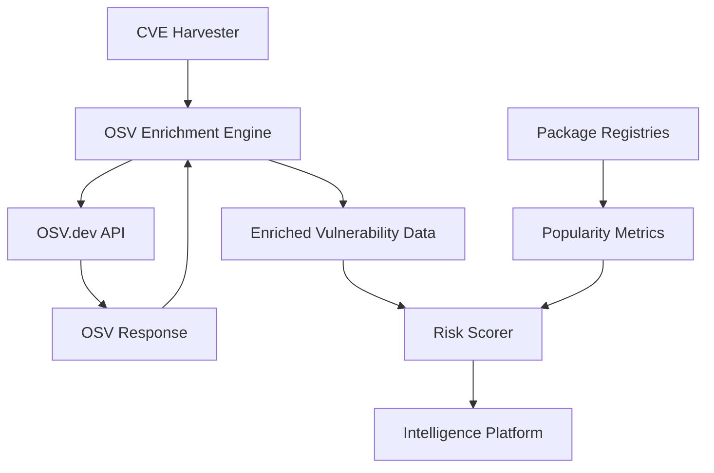

# OSV.dev Integration Design

## Overview

OSV (Open Source Vulnerabilities) is a distributed vulnerability database that provides a unified schema for describing vulnerabilities across different ecosystems. Integrating OSV.dev will enrich our vulnerability data with package-specific information, affected version ranges, and cross-ecosystem insights.

## Benefits of OSV Integration

1. **Unified Schema**: OSV provides standardized vulnerability data across npm, PyPI, Maven, Go, and more
2. **Version Range Intelligence**: Precise affected version information using ecosystem-specific version schemes
3. **Package Ecosystem Data**: Direct links to package managers and dependency information
4. **Fix Information**: Specific commit hashes and version numbers where vulnerabilities are fixed
5. **Cross-references**: Links between CVEs, GitHub Security Advisories, and ecosystem-specific IDs

## Integration Architecture



## Implementation Plan

### 1. OSV Client Implementation

```python
# scripts/harvest/osv_client.py

import asyncio
import aiohttp
from typing import List, Dict, Optional
from dataclasses import dataclass
from datetime import datetime

@dataclass
class OSVVulnerability:
    """OSV vulnerability data model"""
    id: str
    modified: datetime
    published: datetime
    aliases: List[str]  # CVE IDs, GHSA IDs, etc.
    summary: str
    details: str
    severity: List[Dict]
    affected: List[Dict]
    references: List[Dict]
    database_specific: Dict

class OSVClient:
    """Client for interacting with OSV.dev API"""
    
    BASE_URL = "https://api.osv.dev/v1"
    
    def __init__(self, session: aiohttp.ClientSession):
        self.session = session
        self.cache = {}
        
    async def query_by_cve(self, cve_id: str) -> Optional[OSVVulnerability]:
        """Query OSV for a specific CVE"""
        
        # Check cache first
        if cve_id in self.cache:
            return self.cache[cve_id]
        
        payload = {
            "queries": [{
                "aliases": [cve_id]
            }]
        }
        
        try:
            async with self.session.post(
                f"{self.BASE_URL}/querybatch",
                json=payload
            ) as response:
                data = await response.json()
                
                if data.get("results") and data["results"][0]:
                    vulns = data["results"][0].get("vulns", [])
                    if vulns:
                        osv_vuln = self._parse_vulnerability(vulns[0])
                        self.cache[cve_id] = osv_vuln
                        return osv_vuln
                        
        except Exception as e:
            logger.error(f"OSV query failed for {cve_id}: {e}")
            
        return None
    
    async def query_by_package(
        self, 
        ecosystem: str, 
        package: str,
        version: Optional[str] = None
    ) -> List[OSVVulnerability]:
        """Query vulnerabilities for a specific package"""
        
        query = {
            "package": {
                "ecosystem": ecosystem,
                "name": package
            }
        }
        
        if version:
            query["version"] = version
            
        payload = {"queries": [query]}
        
        try:
            async with self.session.post(
                f"{self.BASE_URL}/querybatch",
                json=payload
            ) as response:
                data = await response.json()
                
                if data.get("results") and data["results"][0]:
                    vulns = data["results"][0].get("vulns", [])
                    return [self._parse_vulnerability(v) for v in vulns]
                    
        except Exception as e:
            logger.error(f"OSV query failed for {package}: {e}")
            
        return []
    
    def _parse_vulnerability(self, data: Dict) -> OSVVulnerability:
        """Parse OSV API response into our data model"""
        
        return OSVVulnerability(
            id=data["id"],
            modified=datetime.fromisoformat(data["modified"].rstrip("Z")),
            published=datetime.fromisoformat(data["published"].rstrip("Z")),
            aliases=data.get("aliases", []),
            summary=data.get("summary", ""),
            details=data.get("details", ""),
            severity=data.get("severity", []),
            affected=data.get("affected", []),
            references=data.get("references", []),
            database_specific=data.get("database_specific", {})
        )
```

### 2. Enrichment Engine

```python
# scripts/processing/osv_enrichment.py

from typing import Dict, List, Optional, Tuple
import semver
from packaging import version

class OSVEnrichmentEngine:
    """Enrich CVE data with OSV intelligence"""
    
    def __init__(self, osv_client: OSVClient):
        self.osv_client = osv_client
        self.ecosystem_handlers = {
            "npm": self._handle_npm,
            "PyPI": self._handle_pypi,
            "Maven": self._handle_maven,
            "Go": self._handle_go,
            "crates.io": self._handle_crates
        }
    
    async def enrich_vulnerability(self, cve_data: Dict) -> Dict:
        """Enrich CVE with OSV data"""
        
        # Query OSV for this CVE
        osv_vuln = await self.osv_client.query_by_cve(cve_data["cve_id"])
        
        if not osv_vuln:
            return cve_data
            
        # Extract enrichment data
        enriched = cve_data.copy()
        enriched["osv_data"] = {
            "id": osv_vuln.id,
            "aliases": osv_vuln.aliases,
            "affected_packages": self._extract_affected_packages(osv_vuln),
            "fix_versions": self._extract_fix_versions(osv_vuln),
            "severity_scores": self._extract_severity_scores(osv_vuln),
            "references": self._extract_references(osv_vuln),
            "exploitability": self._assess_exploitability(osv_vuln)
        }
        
        # Add package-specific intelligence
        for package in enriched["osv_data"]["affected_packages"]:
            ecosystem = package["ecosystem"]
            if ecosystem in self.ecosystem_handlers:
                package["ecosystem_data"] = await self.ecosystem_handlers[ecosystem](
                    package
                )
        
        return enriched
    
    def _extract_affected_packages(self, osv_vuln: OSVVulnerability) -> List[Dict]:
        """Extract and normalize affected package information"""
        
        packages = []
        
        for affected in osv_vuln.affected:
            package_info = {
                "ecosystem": affected["package"]["ecosystem"],
                "name": affected["package"]["name"],
                "affected_versions": [],
                "fixed_versions": []
            }
            
            # Parse version ranges
            for range_info in affected.get("ranges", []):
                range_type = range_info["type"]
                
                for event in range_info.get("events", []):
                    if "introduced" in event:
                        package_info["affected_versions"].append({
                            "type": "introduced",
                            "version": event["introduced"]
                        })
                    elif "fixed" in event:
                        package_info["fixed_versions"].append(event["fixed"])
                    elif "last_affected" in event:
                        package_info["affected_versions"].append({
                            "type": "last_affected",
                            "version": event["last_affected"]
                        })
            
            # Add specific affected versions
            if "versions" in affected:
                package_info["specific_versions"] = affected["versions"]
                
            packages.append(package_info)
            
        return packages
    
    def _extract_fix_versions(self, osv_vuln: OSVVulnerability) -> Dict[str, List[str]]:
        """Extract fix versions by ecosystem"""
        
        fix_versions = {}
        
        for affected in osv_vuln.affected:
            ecosystem = affected["package"]["ecosystem"]
            package = affected["package"]["name"]
            key = f"{ecosystem}:{package}"
            
            fix_versions[key] = []
            
            for range_info in affected.get("ranges", []):
                for event in range_info.get("events", []):
                    if "fixed" in event:
                        fix_versions[key].append(event["fixed"])
                        
        return fix_versions
    
    def _extract_severity_scores(self, osv_vuln: OSVVulnerability) -> Dict:
        """Extract and normalize severity scores"""
        
        scores = {
            "cvss_v3": None,
            "cvss_v2": None,
            "ecosystem_scores": {}
        }
        
        for severity in osv_vuln.severity:
            if severity["type"] == "CVSS_V3":
                scores["cvss_v3"] = {
                    "score": severity.get("score"),
                    "vector": severity.get("vector")
                }
            elif severity["type"] == "CVSS_V2":
                scores["cvss_v2"] = {
                    "score": severity.get("score"),
                    "vector": severity.get("vector")
                }
            else:
                # Ecosystem-specific scores
                scores["ecosystem_scores"][severity["type"]] = severity.get("score")
                
        return scores
    
    def _assess_exploitability(self, osv_vuln: OSVVulnerability) -> Dict:
        """Assess exploitability based on OSV data"""
        
        exploitability = {
            "has_poc": False,
            "has_exploit": False,
            "actively_exploited": False,
            "exploit_references": []
        }
        
        # Check references for exploit indicators
        exploit_keywords = ["exploit", "poc", "proof of concept", "metasploit"]
        active_keywords = ["actively exploited", "in the wild", "itw"]
        
        for ref in osv_vuln.references:
            url = ref.get("url", "").lower()
            ref_type = ref.get("type", "").lower()
            
            if any(keyword in url for keyword in exploit_keywords):
                exploitability["has_poc"] = True
                exploitability["exploit_references"].append(url)
                
            if ref_type == "exploit":
                exploitability["has_exploit"] = True
                exploitability["exploit_references"].append(url)
                
            if any(keyword in url for keyword in active_keywords):
                exploitability["actively_exploited"] = True
                
        return exploitability
```

### 3. Package Ecosystem Handlers

```python
# scripts/harvest/package_handlers.py

class PackageEcosystemHandlers:
    """Handle ecosystem-specific package intelligence"""
    
    async def _handle_npm(self, package_info: Dict) -> Dict:
        """Fetch npm-specific package data"""
        
        package_name = package_info["name"]
        
        # Query npm registry
        npm_data = await self._fetch_npm_data(package_name)
        
        return {
            "weekly_downloads": npm_data.get("downloads", {}).get("weekly", 0),
            "dependents_count": npm_data.get("dependentsCount", 0),
            "latest_version": npm_data.get("dist-tags", {}).get("latest"),
            "last_publish": npm_data.get("time", {}).get("modified"),
            "maintainers": [m["name"] for m in npm_data.get("maintainers", [])],
            "repository": npm_data.get("repository", {}).get("url"),
            "homepage": npm_data.get("homepage"),
            "deprecated": npm_data.get("deprecated") is not None
        }
    
    async def _handle_pypi(self, package_info: Dict) -> Dict:
        """Fetch PyPI-specific package data"""
        
        package_name = package_info["name"]
        
        # Query PyPI API
        pypi_data = await self._fetch_pypi_data(package_name)
        
        # Get download stats from PyPI stats API
        download_stats = await self._fetch_pypi_stats(package_name)
        
        return {
            "monthly_downloads": download_stats.get("data", {}).get("last_month", 0),
            "total_downloads": download_stats.get("data", {}).get("total", 0),
            "latest_version": pypi_data.get("info", {}).get("version"),
            "requires_python": pypi_data.get("info", {}).get("requires_python"),
            "author": pypi_data.get("info", {}).get("author"),
            "homepage": pypi_data.get("info", {}).get("home_page"),
            "repository": pypi_data.get("info", {}).get("project_urls", {}).get("Source"),
            "classifiers": pypi_data.get("info", {}).get("classifiers", [])
        }
    
    async def _handle_maven(self, package_info: Dict) -> Dict:
        """Fetch Maven Central data"""
        
        # Split group and artifact IDs
        parts = package_info["name"].split(":")
        if len(parts) != 2:
            return {}
            
        group_id, artifact_id = parts
        
        # Query Maven Central
        maven_data = await self._fetch_maven_data(group_id, artifact_id)
        
        return {
            "usage_count": maven_data.get("response", {}).get("numFound", 0),
            "latest_version": maven_data.get("response", {}).get("docs", [{}])[0].get("latestVersion"),
            "repository_count": len(maven_data.get("response", {}).get("docs", [])),
            "group_id": group_id,
            "artifact_id": artifact_id
        }
```

### 4. Integration with Risk Scoring

```python
# scripts/processing/enhanced_risk_scorer.py

class EnhancedRiskScorer:
    """Risk scoring with OSV enrichment"""
    
    def __init__(self):
        self.osv_enrichment = OSVEnrichmentEngine()
        
    async def calculate_risk_score(self, vuln: Dict) -> float:
        """Calculate risk score with OSV data"""
        
        base_score = self._calculate_base_score(vuln)
        
        # Apply OSV enrichment modifiers
        if "osv_data" in vuln:
            osv_data = vuln["osv_data"]
            
            # Boost for widely used packages
            for package in osv_data.get("affected_packages", []):
                ecosystem_data = package.get("ecosystem_data", {})
                
                if package["ecosystem"] == "npm":
                    downloads = ecosystem_data.get("weekly_downloads", 0)
                    if downloads > 1_000_000:
                        base_score *= 1.5
                    elif downloads > 100_000:
                        base_score *= 1.3
                    elif downloads > 10_000:
                        base_score *= 1.1
                        
                elif package["ecosystem"] == "PyPI":
                    downloads = ecosystem_data.get("monthly_downloads", 0)
                    if downloads > 10_000_000:
                        base_score *= 1.5
                    elif downloads > 1_000_000:
                        base_score *= 1.3
                    elif downloads > 100_000:
                        base_score *= 1.1
            
            # Boost for active exploitation
            if osv_data.get("exploitability", {}).get("actively_exploited"):
                base_score *= 1.4
            elif osv_data.get("exploitability", {}).get("has_exploit"):
                base_score *= 1.2
            elif osv_data.get("exploitability", {}).get("has_poc"):
                base_score *= 1.1
            
            # Penalty if fixes are available
            if osv_data.get("fix_versions"):
                base_score *= 0.8
                
        return min(base_score, 100)
```

## Data Flow Integration

### 1. Modified Harvest Pipeline

```python
# scripts/harvest/orchestrator.py (modified)

class EnhancedOrchestrator:
    def __init__(self):
        self.cve_client = CVEClient()
        self.epss_client = EPSSClient()
        self.osv_client = OSVClient()
        self.osv_enrichment = OSVEnrichmentEngine(self.osv_client)
        
    async def harvest_and_enrich(self):
        """Enhanced harvest with OSV enrichment"""
        
        # 1. Get CVEs as before
        cves = await self.cve_client.fetch_recent_cves()
        
        # 2. Filter by EPSS
        high_risk_cves = await self._filter_by_epss(cves)
        
        # 3. Enrich with OSV data
        enriched_cves = []
        
        async with aiohttp.ClientSession() as session:
            self.osv_client.session = session
            
            # Process in batches for efficiency
            for batch in self._batch(high_risk_cves, 50):
                tasks = [
                    self.osv_enrichment.enrich_vulnerability(cve)
                    for cve in batch
                ]
                enriched_batch = await asyncio.gather(*tasks)
                enriched_cves.extend(enriched_batch)
        
        # 4. Calculate enhanced risk scores
        scored_cves = await self._calculate_risk_scores(enriched_cves)
        
        return scored_cves
```

### 2. Storage Schema Updates

```python
# Updated schema to include OSV data

{
    "cve_id": "CVE-2025-12345",
    "cvss": 9.8,
    "epss": 0.94,
    
    # New OSV enrichment fields
    "osv_data": {
        "osv_id": "OSV-2025-123",
        "affected_packages": [
            {
                "ecosystem": "npm",
                "name": "express",
                "affected_versions": ["<4.18.0"],
                "fixed_versions": ["4.18.1"],
                "ecosystem_data": {
                    "weekly_downloads": 4_200_000,
                    "dependents_count": 12_543,
                    "deprecated": false
                }
            }
        ],
        "exploitability": {
            "has_poc": true,
            "has_exploit": false,
            "actively_exploited": false,
            "exploit_references": ["https://example.com/poc"]
        },
        "fix_available": true,
        "fix_versions": {
            "npm:express": ["4.18.1"]
        }
    },
    
    # Enhanced risk score
    "risk_score": 94.2,
    "risk_factors": [
        "High CVSS score (9.8)",
        "Very high EPSS (94%)",
        "Affects popular package (4.2M weekly downloads)",
        "PoC available",
        "Fix available - upgrade recommended"
    ]
}
```

## Performance Considerations

### 1. Caching Strategy

```python
class OSVCache:
    """Intelligent caching for OSV data"""
    
    def __init__(self):
        self.memory_cache = {}
        self.disk_cache_path = "cache/osv/"
        self.ttl = {
            "vulnerability": 3600 * 24,  # 24 hours
            "package_stats": 3600 * 6,   # 6 hours
            "exploit_status": 3600       # 1 hour
        }
```

### 2. Rate Limiting

```python
class RateLimitedOSVClient(OSVClient):
    """OSV client with rate limiting"""
    
    def __init__(self, *args, **kwargs):
        super().__init__(*args, **kwargs)
        self.rate_limiter = RateLimiter(
            calls=100,
            period=60  # 100 calls per minute
        )
```

## Benefits Summary

1. **Accurate Version Information**: Know exactly which versions are affected
2. **Package Popularity Data**: Prioritize vulnerabilities in widely-used packages
3. **Cross-Reference Intelligence**: Link CVEs to GitHub advisories and package-specific IDs
4. **Fix Availability**: Know immediately if patches are available
5. **Ecosystem Insights**: Understand impact across different package managers

## Next Steps

1. Implement OSV client with proper error handling
2. Create enrichment pipeline with caching
3. Update risk scoring algorithm to use OSV data
4. Modify storage schema to include enrichment
5. Update UI to display package-specific information
6. Add API endpoints for package vulnerability queries